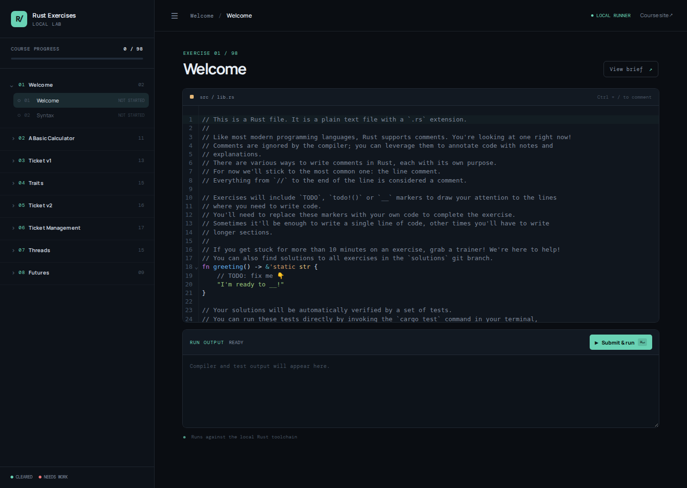

# Learn Rust, one exercise at a time

> [!IMPORTANT]
> This repository is a fork of [mainmatter/100-exercises-to-learn-rust](https://github.com/mainmatter/100-exercises-to-learn-rust).
> It includes a local browser-based exercise lab in [`app/`](app/) for navigating, editing, and running the exercises.

You've heard about Rust, but you never had the chance to try it out?\
This course is for you!

You'll learn Rust by solving 100 exercises.\
You'll go from knowing nothing about Rust to being able to start
writing your own programs, one exercise at a time.

> [!NOTE]
> This course has been written by [Mainmatter](https://mainmatter.com/rust-consulting/).\
> It's one of the trainings in [our portfolio of Rust workshops](https://mainmatter.com/services/workshops/rust/).\
> Check out our [landing page](https://mainmatter.com/rust-consulting/) if you're looking for Rust consulting or
> training!

## Getting started

Go to [rust-exercises.com](https://rust-exercises.com) and follow the instructions there
to get started with the course.

## Local exercise lab

This fork includes a local web app with a collapsible exercise navigator,
Rust syntax highlighting, session-based progress tracking, and a Cargo-backed
submit-and-run workflow.

```bash
cd app
npm install
npm run dev
```

Then open [http://localhost:5173](http://localhost:5173). For a single-port
local run, use `npm run build && npm start` and open
[http://localhost:3001](http://localhost:3001).

See [`app/README.md`](app/README.md) for details.

Exercise code and progress are saved in browser `localStorage`, so they persist
across tabs and browser restarts.

### Local lab preview



## Requirements

- **Rust** (follow instructions [here](https://www.rust-lang.org/tools/install)).\
  If `rustup` is already installed on your system, run `rustup update` (or another appropriate command depending on how
  you installed Rust on your system)
  to make sure you're running on the latest stable version.
- _(Optional but recommended)_ An IDE with Rust autocompletion support.
  We recommend one of the following:
  - [RustRover](https://www.jetbrains.com/rust/);
  - [Visual Studio Code](https://code.visualstudio.com) with
    the [`rust-analyzer`](https://marketplace.visualstudio.com/items?itemName=matklad.rust-analyzer) extension.

## Solutions

You can find the solutions to the exercises in
the [`solutions` branch](https://github.com/mainmatter/100-exercises-to-learn-rust/tree/solutions) of this repository.

# License

Copyright © 2024- Mainmatter GmbH (https://mainmatter.com), released under the
[Creative Commons Attribution-NonCommercial 4.0 International license](https://creativecommons.org/licenses/by-nc/4.0/).
